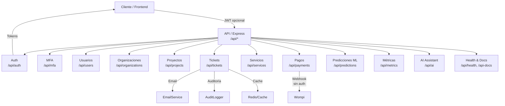

# 🗺️ Mapa Completo de Rutas y Flujos del Backend VioTech

Guía exhaustiva de todos los endpoints disponibles en el backend (`/api/*`), con su protección, limitadores y flujo general de interacción.

## Convenciones globales
- **Base path**: todas las rutas cuelgan de `/api` (ej.: `/api/auth/login`).
- **Rate limiting global**: `generalLimiter` aplicado sobre `/api/*`.
- **Autenticación**: `authMiddleware` valida JWT (Bearer). Algunas rutas requieren roles específicos vía `requireRole`.
- **Formato de respuesta**: `successResponse`, `errorResponse`, `validationErrorResponse`, `authErrorResponse`.
- **Cache**: algunas rutas usan `utils/cache` (ej.: tickets, organizaciones).
- **Swagger**: UI en `/api-docs` (sin auth).

## Diagrama de flujo API

## Resumen por módulo
| Módulo | Base | Auth | Roles | Rate limit | Notas |
|---|---|---|---|---|---|
| Auth | `/api/auth` | Mixto | N/A | `authLimiter` en login/registro/refresh/forgot/reset | Manejo de JWT y contraseñas |
| MFA | `/api/mfa` | Sí | N/A | - | Setup/verify/disable/status |
| Usuarios | `/api/users` | Sí | admin/agente (GET), admin (PUT) | - | Gestión de rol/tier/estado/org |
| Organizaciones | `/api/organizations` | Sí | crear/actualizar: agente/admin | `orgLimiter` en GET / | Cachea respuestas |
| Proyectos | `/api/projects` | Sí | crear/actualizar: agente/admin | - | Filtra por organización |
| Tickets | `/api/tickets` | Sí | cliente/agente/admin | - | CRUD + comentarios + adjuntos |
| Servicios | `/api/services` | `/me` requiere auth | N/A | - | Catálogo público |
| Pagos | `/api/payments` | Sí (except webhook) | N/A | `paymentLimiter` | Wompi webhook sin auth |
| IA | `/api/ai` | ticket-assistant/create-ticket requiere auth | N/A | `aiLimiter` | Generación y creación de tickets asistidos |
| Predicciones | `/api/predictions` | No | N/A | `predictionLimiter`, `modelStatusLimiter` | Timeline de proyectos |
| Métricas | `/api/metrics` | Sí | N/A | `metricsLimiter` | Dashboard |
| Health & Docs | `/api/health`, `/api-docs` | No | N/A | - | Estado y Swagger |

## Detalle de endpoints

### Autenticación (`/api/auth`)
- `POST /registro` — público — `authLimiter` — Registro de usuario (hash de password, welcome email).
- `POST /login` — público — `authLimiter` — Login, entrega `token` y `refreshToken`, auditoría.
- `GET /me` — requiere auth — Perfil del usuario autenticado.
- `POST /logout` — requiere auth — Revoca token (blacklist) y audita logout.
- `POST /refresh` — público — `authLimiter` — Refresca access token usando refresh token.
- `PUT /password` — requiere auth — Cambia contraseña, invalida token y envía email.
- `POST /forgot-password` — público — `authLimiter` — Genera token de reset y envía email.
- `POST /reset-password` — público — `authLimiter` — Resetea contraseña usando token y notifica.

### MFA (`/api/mfa`) – siempre requiere auth
- `POST /setup` — Genera secreto TOTP y QR (no habilita todavía).
- `POST /verify` — Valida token TOTP y habilita MFA, entrega códigos de respaldo.
- `POST /disable` — Verifica contraseña y deshabilita MFA.
- `GET /status` — Devuelve `mfaEnabled`.

### Usuarios (`/api/users`)
- `GET /` — requiere auth + rol `admin` o `agente` — Lista usuarios.
- `PUT /:id/role` — requiere auth + rol `admin` — Cambia rol (`cliente`, `agente`, `admin`).
- `PUT /:id/tier` — requiere auth + rol `admin` — Actualiza tier.
- `PUT /:id/state` — requiere auth + rol `admin` — Cambia estado (`activo`, `inactivo`).
- `PUT /:id/organization` — requiere auth + rol `admin` — Asigna organización.

### Organizaciones (`/api/organizations`) – requiere auth
- `GET /` — `orgLimiter` — Cliente solo ve su organización; agente/admin ven todas (usa cache).
- `GET /:id` — Cliente solo puede ver su organización; agente/admin sin restricción.
- `POST /` — rol `agente` o `admin` — Crea organización y limpia cache.
- `PUT /:id` — rol `agente` o `admin` — Actualiza organización y limpia cache.

### Proyectos (`/api/projects`) – requiere auth
- `GET /` — Filtra por `organizationId` (cliente solo su organización).
- `GET /:id` — Incluye tickets asociados; cliente validado por organización.
- `POST /` — rol `agente` o `admin` — Crea proyecto.
- `PUT /:id` — rol `agente` o `admin` — Actualiza proyecto.

### Tickets (`/api/tickets`) – requiere auth
- `GET /` — Lista con paginación y filtros (estado, prioridad, impacto, urgencia, categoria, asignadoA, projectId, organizationId). Cache por usuario/rol.
- `GET /:id` — Detalle; cliente validado por organización.
- `POST /` — Crea ticket; cliente puede crear solo para sí; agente/admin puede definir usuario/organización/asignado.
- `PUT /:id` — Actualiza campos (estado, prioridad, impacto, urgencia, categoría, SLA, asignado, proyecto, etiquetas).
- `POST /:ticketId/comment` — Agrega comentario (auditoría + email).
- `GET /:ticketId/attachments` — Lista adjuntos.
- `POST /:ticketId/attachments` — Sube adjunto.
- `DELETE /:ticketId/attachments/:attachmentId` — Elimina adjunto.

### Servicios (`/api/services`)
- `GET /me` — requiere auth — Servicios del usuario autenticado.
- `GET /catalog` — público — Catálogo de servicios.

### Pagos (`/api/payments`)
- `POST /prepare-widget` — requiere auth — `paymentLimiter` — Prepara payload para widget Wompi.
- `POST /create-transaction` — requiere auth — `paymentLimiter` — Creación de transacción (legacy redirect).
- `POST /wompi-webhook` — público (sin auth) — `express.raw` — Webhook de Wompi para eventos de pago.

### AI Assistant (`/api/ai`)
- `POST /ticket-assistant` — público — `aiLimiter` — Genera respuesta/sugerencias usando proveedor IA.
- `POST /ticket-assistant/create-ticket` — requiere auth — `aiLimiter` — Genera respuesta y crea ticket (valida rol para crear para otros usuarios).

### Predicciones ML (`/api/predictions`)
- `POST /project-timeline` — público — `predictionLimiter` — Normaliza/valida payload y devuelve predicción de timeline de proyecto.
- `GET /model-status` — público — `modelStatusLimiter` — Estado del modelo de predicciones.

### Métricas (`/api/metrics`) – requiere auth
- `GET /dashboard` — `metricsLimiter` — Métricas del dashboard del usuario autenticado.

### Health & Docs
- `GET /api/health` — público — Estado del backend y metadata (timestamp, environment).
- `GET /api-docs` — público — Swagger UI con la especificación OpenAPI generada.

## Flujo típico de consumo
1) `POST /api/auth/login` → obtiene `token` y `refreshToken`.  
2) Con `Authorization: Bearer <token>`, consumir módulos protegidos (tickets, usuarios, organizaciones, etc.).  
3) Renovar token con `POST /api/auth/refresh` antes de que expire.  
4) Enviar/recibir pagos con `POST /api/payments/prepare-widget` y procesar notificaciones desde Wompi en `POST /api/payments/wompi-webhook`.  
5) Para seguridad extra, habilitar MFA con `/api/mfa/setup` y `/api/mfa/verify`.  
6) Consultar estado general con `/api/health` o documentación con `/api-docs`.

## Notas operativas
- Todos los endpoints bajo `/api` están sujetos al rate limit global y pueden tener limitadores específicos adicionales.
- Cache: tickets y organizaciones usan TTLs cortos/medios; invalidación ocurre en creaciones/actualizaciones.
- Auditoría: login/logout, creación/actualización de tickets/comentarios y MFA registran eventos en `AuditLogger`.
- Emails: registro, cambio/reset de contraseña, creación de tickets y comentarios disparan correos asíncronos.

